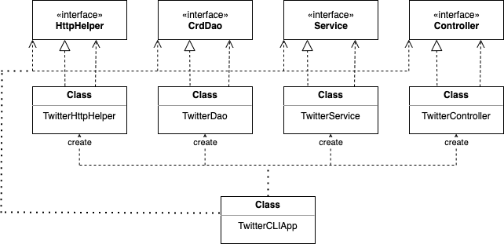
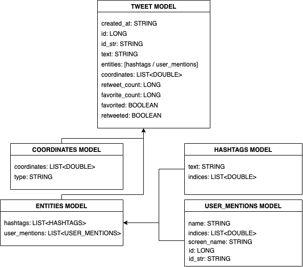

# Twitter CLI Application

## <ins>Introduction
The `Twitter Command Line Interface (CLI) Application` 

__Targeted User:__ The product can be used by anyone who would like
to post | show | delete a tweet using command line interface. It 
will be especially usefull for people who post regularly on Twitter.

__Technologies:__
> <span style = "color:green"> Git | Docker | Java SE 8 | Apache Maven | Twitter Rest API </span>

## <ins> Quick Start
Pull image from Docker

`docker pull deelango/twittercli`

Obtain your 
   <span style = "color:blue"> consumerKey </span> |
   <span style = "color:blue"> consumerSecret </span> |
   <span style = "color:blue"> accessToken </span> |
   <span style = "color:blue"> tokenSecret </span>
   from Twitter Developer's Portal
```
docker run --rm \
-e consumerKey= null \
-e consumerSecret= null \
-e accessToken= null \
-e tokenSecret= null \
deelango/twittercli post|show|delete [options]
```

#### Post
```
docker run --rm \
-e consumerKey= null \
-e consumerSecret= null \
-e accessToken= null \
-e tokenSecret= null \
deelango/twittercli post "message" latitude:longitude
```
#### Show 
```
docker run --rm \
-e consumerKey= null \
-e consumerSecret= null \
-e accessToken= null \
-e tokenSecret= null \
deelango/twittercli show id_of_tweet
```
#### Delete
```
docker run --rm \
-e consumerKey= null \
-e consumerSecret= null \
-e accessToken= null \
-e tokenSecret= null \
deelango/twittercli delete id_of_tweet
```

## <ins> UML Diagram


#### Description of the components


## <ins> Model
The following diagram will illustrate the `Tweet` model and its dependencies 
[`Coordinates`, `Entities`, `Hashtags`, and `UserMentions`]



## <ins> Spring

## <ins> Test
I tested the application using sample data in the customer and orders table, and performed some sample
queries to test if the application is working.

## <ins> Improvements
