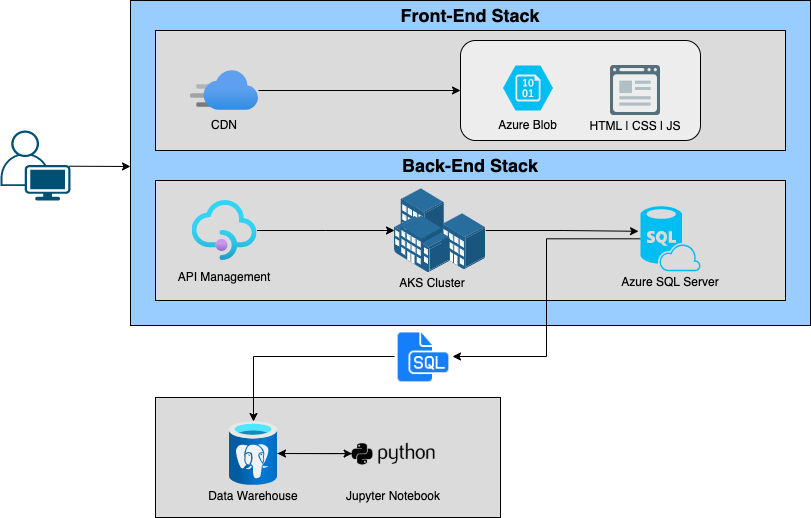

# Python Data Analytics
## <ins> Introduction
Jarvis Software Development (JSD) team was approached by the London Gift Shop (LGS) to develop a
Proof-Of-Concept (POC) project that will help the LGS marketing team to analyze customer shopping
behaviour. LGS is an online wholesale retailer who has been selling gifts-ware products for the
past 10 years, however, recently their revenue has stagnated. With the help of the JSD team, they hope
to understand their customers better.

__Targeted User:__ The product will be used by the LGS marketing team to develop targeted marketing
campaigns to attract new and existing customers with a goal to develop sales and marketing techniques

__Technologies:__
>  Git | Docker | Jupyter Notebook | Pandas Dataframe | NumPy | MatPlotLib | PostgreSQL Data Warehouse 

## <ins> Implementation
### Project Architecture

LGS's Azure environment consists of a Front-End and Back-End stack, the Front-End stack takes care
of user transactions by providing an interactive GUI for the clients to place their order while the
Back-End is responsible for storing that information into the Azure SQL server. The JSD team requested
that the LGS's IT team dump their transaction data between 01/12/2009 and 09/12/2011 into a SQL File
which will be used by the JSD team to set up a local data warehouse using PostgreSQL and analyze the data
using Jupyter Notebook

##### __Attributes__
The SQL file `[retail.sql]` contains the following attributes:

- `invoice_no:` The Invoice number is a 6-digit integral number uniquely assigned to each transaction. If this code starts with the letter `'C'`, it indicates a cancellation
- `stock_code:` The Product code is a 5-digit integral number uniquely assigned to each item
- `description:` Refers to the name of the Product
- `quantity:` Refers to the number of items the transaction consisted of
- `invoice_date:` The day and time when the transaction was generated
- `unit_price:` The price per unit of the item the customer is buying
- `customer_id:` The Customer id is a 5-digit integral number uniquely assigned to each customer
- `country:` The country the item was purchased from

### Data Analytics and Wrangling
LGS Analysis: [LGS Jupyter Notebook](./retail_data_analytics_wrangling.ipynb)

The `LGS Jupyter Notebook]` consists of the following sections:

- `Total Invoice Amount Distribution`
    - This section illustrates a graphical view of the total invoice amount for all the transactions
- `Monthly Placed and Canceled Orders`
    - This bar chart examines the amount of orders that were placed and canceled for any given month
- `Monthly Sales`
    - This graph examines monthly sales over the timeframe of the data
- `Monthly Sales Growth`
    - This graph examines monthly sales growth in % over the timeframe of the data
- `Monthly Active Users`
    - This bar chart examines monthly active users over the timeframe of the data
- `New and Existing Users`
    - This bar chart examines monthly new and existing users over the timeframe of the data
- `RFM`
    - The Recency, Frequency, Monetary [RFM] score is a technique that helps
      determine marketing and sales strategies based on buying habits of customers
        - `Recency:` Time since customer last purchase
        - `Frequency:` Total number of purchases
        - `Monetary:` Total spending by the customer
- `RFM Segmentation`
    - This would allow the LGS's marketing team to focus on three groups of customers that are vital to the business
        - `Can't lose:` These customers had large amount of transactions in the past, however, recently they have
          not bought anything. By providing some sort of personalized discounts, you can win them over again
        - `Hibernating:` These customer's have not bought anything in a long time.
          By providing some sort of discounts, you can persuade them to buy something
        - `Champions:` Most of LGS's revenue stems from this group, by analyzing this group more, LGS can understand
          their target audience

## <ins> Improvements
- Analyze which items are the most popular in LGS to get a more accurate picture of what is going on
- Extrapolate the current trend to give the marketing team an idea of what they can expect if this trend
  was to continue without any intervention
- Identify any significant trends or backlash the company might have faced during this period that could
  have affected customer behaviour. This could be accomplished by taking a closer look at other department's
  behaviour over the timeframe
