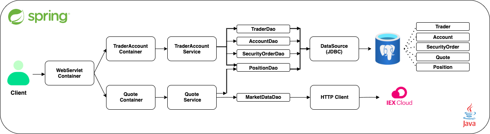

# Springboot Application

## Table of contents
* [Introduction](##Introduction)
* [Quick Start](##QuickStart)
* [Implemenation](##Implemenation)
* [Test](##Test)
* [Deployment](##Deployment)
* [Improvements](##Improvements)

## <ins> Introduction

The `Springboot Application` is aimed at replacing Jarvis Consulting Trading Team's legacy system which is a monolithic 
application that is hard to scale and manage. The `Springboot Application` is capable of managing trader's account, 
buy/sell stocks with funds that you can deposit/withdraw as well as fetch stock information for any company. The
application fetches data from IEX Cloud which offers free market data (e.g. stock price) via its REST API. Apache Tomcat
was used to allow java code to run on an HTTP web server, and SwaggerUI was used to visualize and interact with the application.

__Targeted User:__ The product allows Jarvis Consulting's Trading Team to manage their client's profiles and accounts, 
                   monitor portfolio performance, and trade securities.

__Technologies:__
> <span style = "color:green"> Git | PostgreSQL | Docker (Version >= 17.05) | Java SE 8 | Apache Maven | Springboot | Apache Tomcat | SwaggerUI | IEX Cloud  </span>

## <ins> Quick Start
Pull image from Docker Hub
```
docker pull deelango/trading-psql
docker pull deelango/trading-app
```

Create a docker network
```
sudo docker network create trading-net
```

Execute the Dockerfile in psql _./springboot/psql_
```
cd ./springboot/psql
docker build -t trading-psl . 
docker image ls -f reference=trading-psl
```

Execute the Dockerfile in springboot _./springboot/_
```
cd ./springboot/
docker build -t trading-app . 
docker image ls -f reference=trading-psl
```

Start the trading-psl docker container
```
docker run --name trading-psql-dev \
-e POSTGRES_PASSWORD=password \
-e POSTGRES_DB=jrvstrading \
-e POSTGRES_USER=postgres \
--network trading-net \
-d -p 5432:5432 trading-psl
```

Obtain your _IEX_PUB_TOKEN_ and start the trading-app docker container
```
docker run -d -t --name trading-app-dev \
-e "PSQL_URL=jdbc:postgresql://trading-psql-dev:5432/jrvstrading" \
-e "PSQL_USER=postgres" \
-e "PSQL_PASSWORD=password" \
-e "IEX_PUB_TOKEN=${IEX_PUB_TOKEN}" \
--network trading-net \
-p 8080:8080 -t trading-app
```

We can now access the `Springboot Application` through SwaggerUI by booting up:
> http://localhost:8080/swagger-ui.html


## <ins> Implemenation
### Architecture



**<ins> Stage 1: </ins>**

- Request is received by Apache Tomcat Server which allows java code to run on an HTTP web server
- The server will then relay the request to either the `TraderAccountController` which is responsible for 
requests related to traders or `QuoteController` for requests related to quotes 

**<ins> Stage 2: </ins>**

- The controllers then pass on their respective quotes to the service layers which handles
  the business logic of the application, if successful, the request then travels to the Data Access layer

**<ins> Stage 3: </ins>**

- THE DAO layer is responsible for executing the request from the client, it either fetches stock information
  from IEX Cloud Database or perform CRUD operations on the PostgreSQL database
    -   Note that the java application doesn't store any data, the PSQL database hosts all data


### REST API Usage
#### Swagger

SwaggerUI allows the clients and developers to interactively access the `Springboot Application` in a web browser 
without needing to deal with the implementation logic.

#### Quote Controller
Stock market information is collected from the IEX cloud database and cached in the PSQL database. This
controller allows the users to get access to this information, add them to their daily watch list, and 
update them

- **GET** `/dailyList`: Lists all the quotes that are available to be traded from your *dailyList*
- **GET** `/iex/ticker/{ticker}`: Obtain the most recent stock information for the given ticker (stock)
- **PUT** `/quote/iexMarketData`: Updates stock information for all the quotes in your daily list
- **PUT** `/quote`: Modify the quote in your *dailyList* manually
- **POST** `/tickerId/{tickerId}`: Obtain the stock information for the given *tickerId* and add it to your *dailyList*

#### Trader Controller
- This controller is responsible for managing the trader's profile and account information, it can also be used
to deposit/withdraw money

- **POST**  `/trader/`: Allows the user to create a profile and account for trader manually
- **POST**  `/trader/firstname/{firstname}/lastname/{lastname}/dob/{dob}/country/{country}/email/{email}`: 
Similar to `/trader/`, except this time the trader's profile and account information is passed using the URL
same as /trader/, except that the trader object is passed in the URL instead of the request body
- **PUT** `/trader/deposit/traderId/{traderId}/amount/{amount}`: Deposit money from the account associated with *traderId*
- **PUT** `/trader/withdraw/traderId/{traderId}/amount/{amount}`: Withdraws money from the account associated with *traderId*  
- **DELETE** `/trader/traderId/{traderId}`: Delete a trader by their *traderId*

## <ins> Test
The application was tested using JUnit 4 Integration tests for the `Controller`, `Service`, and `Data Access` Layer. 
The code coverage was more than 60%.

## <ins> Deployment
The `Springboot Application` and `PostgreSQL Database` was dockerized, so it's can be easily deployed to any server.

**<ins> Stage 1: </ins>**
-  Dockerfile was used to package and build the `Springboot Application [trading-app]` and `PostgreSQL Database [trading-psl]` images
    - The `trading-psl` image was created using `postgres:9.6-alpine`, this helped us initialize the database
    with the required tables
    - The `trading-app` image was built with `maven:3.6-jdk-8-slim` and packaged using `openjdk:8-alpine`

**<ins> Stage 2: </ins>**
- Containers: `trading-psql-dev` and `trading-app-dev` are created using the docker run command 
    
**<ins> Stage 3: </ins>**
- A docker network `trading-net` has to be created so that the two containers can communicate with each-other

*Note:*
- You would need your `IEX_PUB_TOKEN` and `PSQL` username/password/database name [jrvstrading] to effectively
run the `trading-psql-dev` and `trading-app-dev` containers
  
## <ins> Improvements
- I would implement a feature that would allow the traders to get the ten top most tending stocks in the market

- Implement Limit/Market orders 

- Implement alternative stock exchanges so that traders can have access to a variety of markets 
